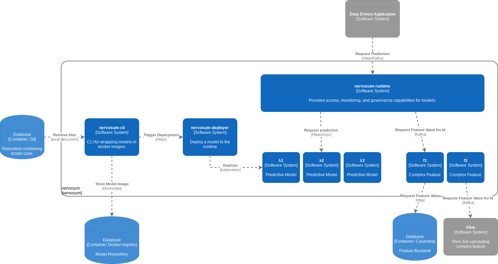
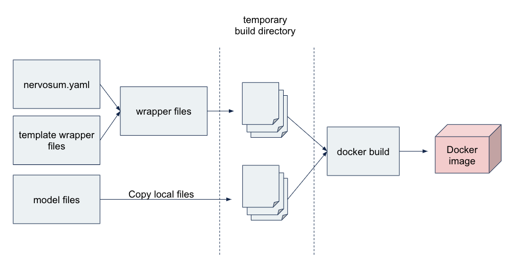

# Nervosum

Nervosum aims to become a machine learning platform in which we incorporate lessons learned from productionalizing machine learned models in various contexts. It offers tooling and platform components to unify a local workflow of data scientists with CI/CD best practices from the software engineering field.

## Reference Architecture



* **nervosum-cli** - A commandline tool to wrap trained ML-models in a docker image.
* **nervosum-deployer** - A deployment component that can be triggered by `nervosum-cli` to deploy a wrapped model to the platform infrastructure.
* **nervosum-runtime** - The component which interfaces deployed models with the wider IT-landscape. It makes models accessible through HTTP and Kafka.

## Release process

We haven't set up automatic releases (see [#9](https://github.com/nervosum/nervosum/issues/9)).

## Installation Nervosum CLI
Clone this repo and install using `pip install .`.

## How to use Nervosum

#### Prerequisites:
In order to build a Nervosum docker image, install the nervosum CLI following the steps described
above. Then make sure to have the following files in place:
* model interface: To interface with a model, Nervosum requires a model class, which acts
as an interface between nervosum and your models. This class should have
the following two methods implemented:
    * `__init__`: This method is responsible for initialize a model instance,
    such that it is available in memory.
    * `predict`:  This method is responsible for rendering a prediction for an input.

    Example model:
    ```python
    # model.py
    import pandas as pd
    class MyModel:
       def __init__(self):
           # load a model
           self.model = ...

       def predict(self, x: pd.DataFrame)->pd.DataFrame:
           # Make prediction for pandas dataframe
           return self.model.predict(x)
    ```

* `requirements.txt` with pip installable model dependencies (if model code has dependencies).
* `nervosum.yaml`: a configuration file denoting the settings for a nervosum build process.

    ```yaml
    name: Name of Nervosum job | Required

    deployment:
      # Deployment properties
      mode: Deployment mode {http, batch} | Required
      platform_tag: platform tag of spark cluster | Required if mode==http

    tag: tag to add to nervosum image, can be used for filtering | Optional

    src: path to source directory with model code | required

    interface:
      # interface properties
      model_module: Relative path from src to module where model class lives | Required
      model_class: Name of model class | Required

    requirements: Pip installable list of model requirements | Optional

    input_schema:
      # input schema properties
      - name: name of field | Required
        type: python data type | Required
      - ...

    output_schema:
      # output schema properties
      - name: name of field | Required
        type: python data type | Required

    ```
#### Building a Nervosum docker image
In order to build the image, please use:
```bash
nervosum build [-c <path/to/nervosum.yaml>] <path/to/build/dir>
```
Whenever a path to the nervosum config file is not presented, the application looks for
`nervosum.yaml` in the build directory.

The diagram below show how nervosum builds a docker image. First, using the nervosum config file,
the wrapper files corresponding to the set deployment mode are generated from a template.
A template can for example be the files to wrap a model as a flask app, or to wrap a model
as a spark job. Then both generated wrapper files and files from the src directory
are copied into a temporary build directory. Subsequently, a docker image is build from this directory,
rendering an image.


#### Listing previously built Nervosum images
Run the following to list previously built Nervosum images:
```bash
nervosum ls [-f FILTER]
```
Where filter could look like:
- `"id=17341941312"`
- `"tag=v0.0.1"`
- `"name=spark_job"`
- `"mode=batch"`

#### Running a nervosum image
A nervosum image can be run by:
```bash
nervosum run [-t TAG] [-n NAME]
```
Where:
* tag refers to the nervosum tag, not the docker image tag.
* name refers to the nervosum image name

Whenever not tag nor name are given, the most recent image will be run.

### Version
